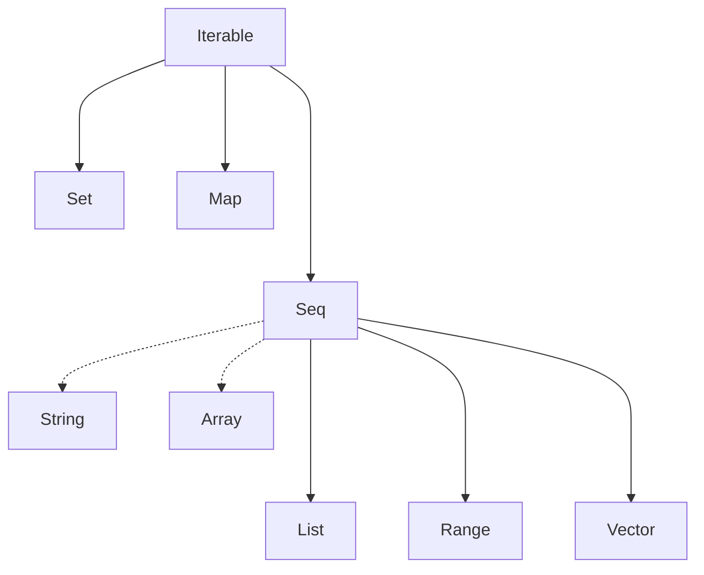

Collections tree:

*** Important remarks ***
    
   >* VECTOR supports the same operations as lists except :: (instead it uses +: or :+)
   
   >* ARRAYS and STRINGS come from Java and support the same operations as Seq and can implicitly be converted to seqs
   
   >* A RANGE represents a sequence of evenly spaced integers, and it has 3 operators:
   >  - to (inclusive)
   >  - until (exclusive)
   >  - by (to determine step value)
   
   >* SET is written analogously to a sequence and most operations on sequences are also available on sets. 
   >  The principal differences between SETS and SEQS:
   >   - Sets are unordered.
   >   - Sets do not have duplicate members.
   >   - The fundamental operation on Sets is contains. 
        
   